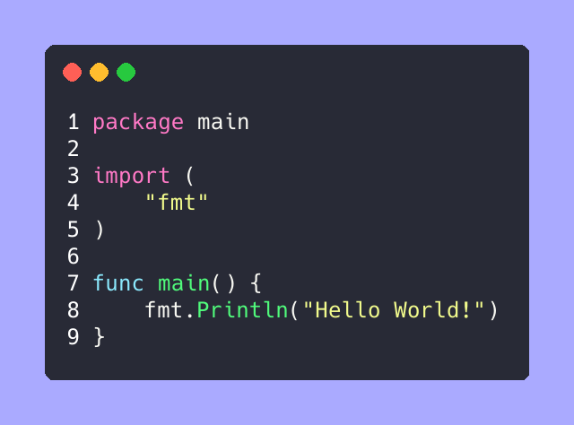

# Germanium

Germanium is an alternative to [Carbon](https://github.com/carbon-app/carbon) and [Silicon](https://github.com/Aloxaf/silicon) implemented in Go.



Germanium can work without browser and internet like Silicon.


## Usage

```
germanium

USAGE:
    germanium [FLAGS] [FILE]

FLAGS:
    -o, --output <PATH>       Write output image to specific filepath [default: ./output.png]
    -b, --background <COLOR>  Background color of the image [default: #aaaaff]
    -f, --font <FONT>         Specify font eg. 'Hack-Bold'
    -l, --language <LANG>     The language for syntax highlighting eg. 'go'
    --list-fonts              List all available fonts in your system
    --no-line-number          Hide the line number
    --no-window-access-bar    Hide the window access bar
```

### Example

Generate image From file

```
germanium -o main.png main.go
```

Generate image From Stdin (need to add option `-l` or `--language`)

```
cat main.go | germanium -l go -o main.png -
```

Generate image without line number

```
germanium --no-line-number -o main.png main.go
```

Generate image without window control bar

```
germanium --no-window-access-bar -o main.png main.go
```


## Install

### GitHub releases

You can download from [here](https://github.com/matsuyoshi30/germanium/releases).

### Arch Linux

```
yay germanium
```

### Build from source

```
git clone https://github.com/matsuyoshi30/germanium
cd germanium && go install
```

#### Requirements

- go1.16


## LICENSE

[MIT](./LICENSE)


## Author

[matsuyoshi30](https://twitter.com/matsuyoshi30)
